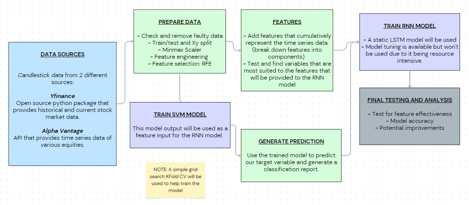

# Using SVM Outputs as a Feature for RNN Models / project2-feature-engineering

Simon Sayson

August 23, 2023

## Description

This program is an extension of my previous project 1 (focused on data). This project takes refined time series features (of stock candlestick data), most notably SVM classification output as a feature for an RNN model. 

## Table of Contents

- [Intro](#Intro)
- [Overview](#Overview)
- [Data Exploration and Preprocessing](#Data-Exploration-and-Preprocessing )
- [Feature Engineering and Analysis](#Feature-Engineering-and-Analysis)
- [Machine Learning Models](#Machine-Learning-Models)
- [Test Results](#Test-Results)
- [Use Cases](#Use-Cases)
- [Future Work](#Future-Work)
- [Details](#Details)
- [Usage](#Usage)

## Intro

This project studies feature engineering methods and the interaction between features from trained machine-learning models as input for other machine-learning models. This program expands on the data framework and adds meaningful features that will be used to train the SVM Model and have the output added to the feature set for the RNN model. Main functionalities include feature engineering, RFE feature selection method for the SVM model inputs, grid search KFold cross-validation methods, and an additional functionality for tuning the RNN model with kerastuners' RandomSearch. Intensive testing will be done with a few different datasets to determine model accuracy.

## Overview



## Data Exploration and Preprocessing

### Sources and Data Characteristics

> [!NOTE]
> This section is similar to the material in my first project but I will keep this here as a reference. Most new data/feature-related topics will be shown in the next section

The primary sources of candlestick time-series data are yfinance's Python package and Alpha Vantage's API. The data I am choosing to extract are similar from both sources but must be formatted appropriately. All data will be primarily handled in the form of pandas data frames. An example of the data formatting, types, and characteristics are listed below:

**Both finance and Alpha Vantage's data have been transformed to this formatting:**

Data columns (total 6 columns):
```
 #   Column  Dtype  
---  ------  -----  
 0   Date    object 
 1   Open    float64
 2   High    float64
 3   Low     float64
 4   Close   float64
 5   Volume  int64  
```

 **Sample df:**
 ```
         Date   Open   High    Low  Close    Volume
0  2018-08-09  19.58  19.71  19.08  19.11  46653400
1  2018-08-10  19.10  19.48  18.86  19.06  65821100
2  2018-08-13  19.16  19.94  19.13  19.73  81411300
3  2018-08-14  19.97  20.29  19.63  20.03  89195500
4  2018-08-15  19.87  20.11  19.21  19.71  86355700
```

### Comparing and Validating Data
Due to the data sources being free and open source, inconsistencies and errors may occur. This is why 2 data sources are selected. Code snippets for the comparative method used are shown below:

(df1 -> yfinance data frame. df2 -> Alpha Vantage data frame)

**Check for similar df shape:**
```
        if df1.shape != df2.shape:
            print('Dataframe shapes do not match!')
            return False
```

**Compare each individual value between dfs using a tolerance:**
```
diff = np.abs(df1 - df2)
        max_tolerance = np.max(np.abs(df1) * tolerance)

        # Check if all values are similar within the tolerance
        are_similar = np.all(diff <= max_tolerance)
```

### Prepare Data
**Cleaning:**
Several methods have been created to:
- Ensure that the data is the correct size
- Handle NaN/Null/Zero values. Either through filtering or basic imputation
- The df is not empty

**Splitting:**
A basic train/test split function is included, along with an additional function that also splits features and labels.

**Scaling/Normalizing:**
A minmax scalar function is included. Additional scaling and normalizing methods may be added in the future, depending on the specific models used.


 
## Feature Engineering and Analysis

There will be one set of features used for the SVM model, and that model output will be an additional feature for the RNN model. RFE selection will be used as part of preprocessing for the SVM model.

### Features and Labels Used:

Here, I'm trying to represent this data by breaking it into components that holistically describe the data through time. To optimize the feature engineering process, considerations for forecast period length must also be accounted for. In this case, the SVM will try to classify if the current price action is the start of a set category of price movement. 

- Base Stock Data:
  - 'Open', 'High', 'Low', 'Close' 'Volume'
     -  The initial data provided from our data sources.

- Base Statistical Data:
  - 'overnight_pctgain', 'intraday_pctgain', 'realized_volatility',  'log_return', 'pct_return', 'sharpe_ratio'
     - These features represent the volatility aspect of the data. Here I'm trying to capture risk perception from various angles.

- Volatility Gauges:
  - 'relative_pct_volatility', 'relative_pct_atr', 'ATR'
    - These represent recent volatility behavior by comparing current time step values to their rolling minimums and maximums.
    - **ATR:** Average true range. A common stock indicator that describes a stock's total change in price over a set rolling period.

- Fluctuations:
    - 'residual_Open', 'residual_High', 'residual_Low', 'residual_Close', 'residual_Volume'
      - Time series decomposition techniques added to some of the other features. These capture the short-term fluctuations of the variables used.

       - **Residual:** A decomposition of the original time series. Similar to time series 'noise'.

- Elementary Change Points:
  - 'ema_changepoint', 'atr_changepoint'
    - These are simple change point detection features based on a crossover of moving averages of different lagging variables (close price and atr).

- 'Target'
   - The label data. Values ranging from 0, 1, 2. Calculated using the following code:

```
    svm_df['Target'] = 0
    svm_df.loc[(svm_df['ema9_9'] > svm_df['ema3_9']) & (svm_df['atr_ema9_9'] < svm_df['ATR_9']), 'Target'] = -1
    svm_df.loc[(svm_df['ema9_9'] < svm_df['ema3_9']) & (svm_df['atr_ema9_9'] < svm_df['ATR_9']), 'Target'] = 1
```
(Values readjusted in the preprocessing stage)

### Feature Selection Considerations

> [!NOTE]
> AMD will be used to analyze these features

To optimize my feature selection methods, the following data was considered:

**RMSE vs Noise Variables of Various ML Models:**


Looking at the nonlinear models section of this study, both the SVM and neural networks have an asymptotic increase in RMSE as it approaches 100 additional noise variables. With this in mind, it may be significant to run RFE for both models.

### Analysis of Potential Variables as RNN Labels

I'll test 2 different variables that are likely candidates for an RNN model to forecast. This is based on the variable's characteristics such as stationarity, IID, and variance.

**The relative_pct Variable:**

Statistics:


We can see that the data is more or less evenly distributed. All other statistical characteristics are as expected from a percentage-type data point.

Autocorrelation:


There seems to be a high autocorrelation for this variable. This type of autocorrelation graph shows that this variable exhibits a random wandering behavior, and autocorrelation also decreases as the lag increases.

**The log_returns Variable:**

Statistics:


We can see a close Gaussian distribution with a kurtosis of 2.68, as expected from log returns. 

Autocorrelation:


Here there is very little autocorrelation.

Stationarity:
From the test.py file, I also tested the stationarity of each variable using an ADF (Augmented Dickey-Fuller) test for stationarity, with the following p-values:

```
p-value for relative_pct: 9.62030635325794e-09
p-value for log_return: 3.1381392692853873e-24
```

With p-values below 

**Results:**


## Machine Learning Models

**Model Selection:**
As this project's primary focus is data gathering, cleaning, and analyzing, I'll select a commonly used classification algorithm such as SVMs. 

**Validation:**
A grid search kfold cross-validation method will be used to validate the model during training.

## Test Results

Using historical data spanning five years for the ticker 'AMD' and utilizing the trained SVM model, I was able to come up with these results:

```
Number of test samples: 143
              precision    recall  f1-score     support
0.0            0.292929  0.725000  0.417266   40.000000
1.0            0.375000  0.193548  0.255319   31.000000
2.0            0.750000  0.291667  0.420000   72.000000
accuracy       0.391608  0.391608  0.391608    0.391608
macro avg      0.472643  0.403405  0.364195  143.000000
weighted avg   0.540854  0.391608  0.383535  143.000000
```

Since there are three classes, an effective model should be able to classify a dataset correctly at a minimum of 33%, surpassing random guessing estimates. With a model accuracy of 39%, there's an improvement of around **18%** in successfully classifying stock trends.

## Use Cases

### Low Volatility Options Strategies

These strategies exploit the implied volatility variable in options pricing models to collect premium.

**Iron Condors, Credit Spreads, Butterfly Spreads:** When the model indicates that the stock price is likely to remain within the ATR range, signifying consolidation (prediction of 1), these options strategies can be formulated. The ATR can be used to identify estimated price ranges for potential strike prices, with the chosen window size serving as the option expiration timeframe.

### Price Trend Options Strategies

**Covered Calls, Cash Secured Puts:**  Similarly, these strategies allow the collection of options premium when the model predicts the stock to follow a trend rather than consolidating (prediction of 0 or 2).

## Future Work

- **Current Project Updates:** Additional functions may be added to improve this project such as:
    - Expanded feature selection techniques (specific to the model)
    - Hyperparameter tuning of feature selection techniques
    - Preliminary feature engineering function
    - Improved OOP/formatting
- **Deep Dive into Feature Engineering of Time Series Data for ML Models:** Research and test various time series feature engineering techniques to improve model performance. (Feature extraction of nonstationary time series data to use as a label for RNN model?...)
- **Other ML Algos:** Apply other machine learning methods to gain more insight into stock data.

## Details

**Packages used:**
```

appdirs                   1.4.4                    pypi_0    pypi
attrs                     23.1.0                   pypi_0    pypi
beautifulsoup4            4.12.2                   pypi_0    pypi
ca-certificates           2023.05.30           haa95532_0
certifi                   2023.7.22                pypi_0    pypi
charset-normalizer        3.2.0                    pypi_0    pypi
colorama                  0.4.6                    pypi_0    pypi
contourpy                 1.1.0                    pypi_0    pypi
cycler                    0.11.0                   pypi_0    pypi
dacite                    1.8.1                    pypi_0    pypi
fonttools                 4.42.0                   pypi_0    pypi
frozendict                2.3.8                    pypi_0    pypi
html5lib                  1.1                      pypi_0    pypi
htmlmin                   0.1.12                   pypi_0    pypi
idna                      3.4                      pypi_0    pypi
imagehash                 4.3.1                    pypi_0    pypi
importlib-resources       6.0.1                    pypi_0    pypi
jinja2                    3.1.2                    pypi_0    pypi
joblib                    1.3.2                    pypi_0    pypi
kiwisolver                1.4.4                    pypi_0    pypi
lxml                      4.9.3                    pypi_0    pypi
markupsafe                2.1.3                    pypi_0    pypi
matplotlib                3.7.2                    pypi_0    pypi
multimethod               1.9.1                    pypi_0    pypi
multitasking              0.0.11                   pypi_0    pypi
networkx                  3.1                      pypi_0    pypi
numpy                     1.23.5                   pypi_0    pypi
openssl                   3.0.10               h2bbff1b_0
packaging                 23.1                     pypi_0    pypi
pandas                    2.0.3                    pypi_0    pypi
patsy                     0.5.3                    pypi_0    pypi
phik                      0.12.3                   pypi_0    pypi
pillow                    10.0.0                   pypi_0    pypi
pip                       23.2.1           py39haa95532_0
pydantic                  1.10.12                  pypi_0    pypi
pyparsing                 3.0.9                    pypi_0    pypi
python                    3.9.17               h1aa4202_0
python-dateutil           2.8.2                    pypi_0    pypi
pytz                      2023.3                   pypi_0    pypi
pywavelets                1.4.1                    pypi_0    pypi
pyyaml                    6.0.1                    pypi_0    pypi
requests                  2.31.0                   pypi_0    pypi
scikit-learn              1.3.0                    pypi_0    pypi
scipy                     1.11.1                   pypi_0    pypi
seaborn                   0.12.2                   pypi_0    pypi
setuptools                68.0.0           py39haa95532_0
six                       1.16.0                   pypi_0    pypi
soupsieve                 2.4.1                    pypi_0    pypi
sqlite                    3.41.2               h2bbff1b_0
statsmodels               0.14.0                   pypi_0    pypi
ta                        0.10.2                   pypi_0    pypi
tangled-up-in-unicode     0.2.0                    pypi_0    pypi
threadpoolctl             3.2.0                    pypi_0    pypi
tqdm                      4.66.1                   pypi_0    pypi
typeguard                 2.13.3                   pypi_0    pypi
typing-extensions         4.7.1                    pypi_0    pypi
tzdata                    2023.3                   pypi_0    pypi
urllib3                   2.0.4                    pypi_0    pypi
vc                        14.2                 h21ff451_1
visions                   0.7.5                    pypi_0    pypi
vs2015_runtime            14.27.29016          h5e58377_2
webencodings              0.5.1                    pypi_0    pypi
wheel                     0.38.4           py39haa95532_0
wordcloud                 1.9.2                    pypi_0    pypi
ydata-profiling           4.5.1                    pypi_0    pypi
yfinance                  0.2.27                   pypi_0    pypi
zipp                      3.16.2                   pypi_0    pypi

```

## Usage

Once this repo is imported, go to the final.py file. Since there will be different directories (mine is removed), df1 and df2 variables can be removed. There is a variable called 'example_retest', that, if set to True, retrieves pre-generated data that can be used for later operations. Once that is done, run final.py.


